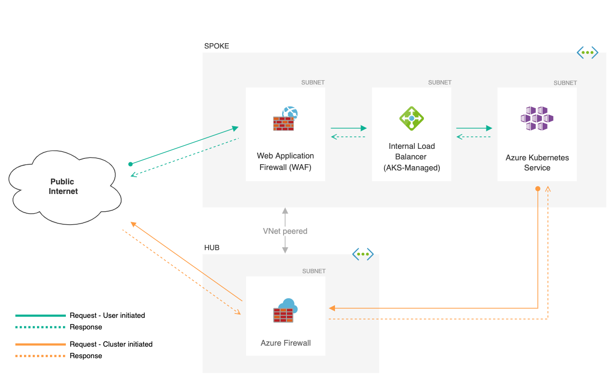
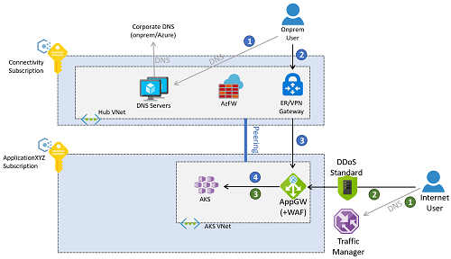
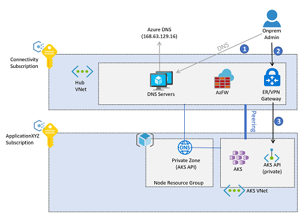
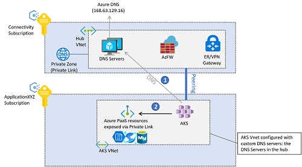
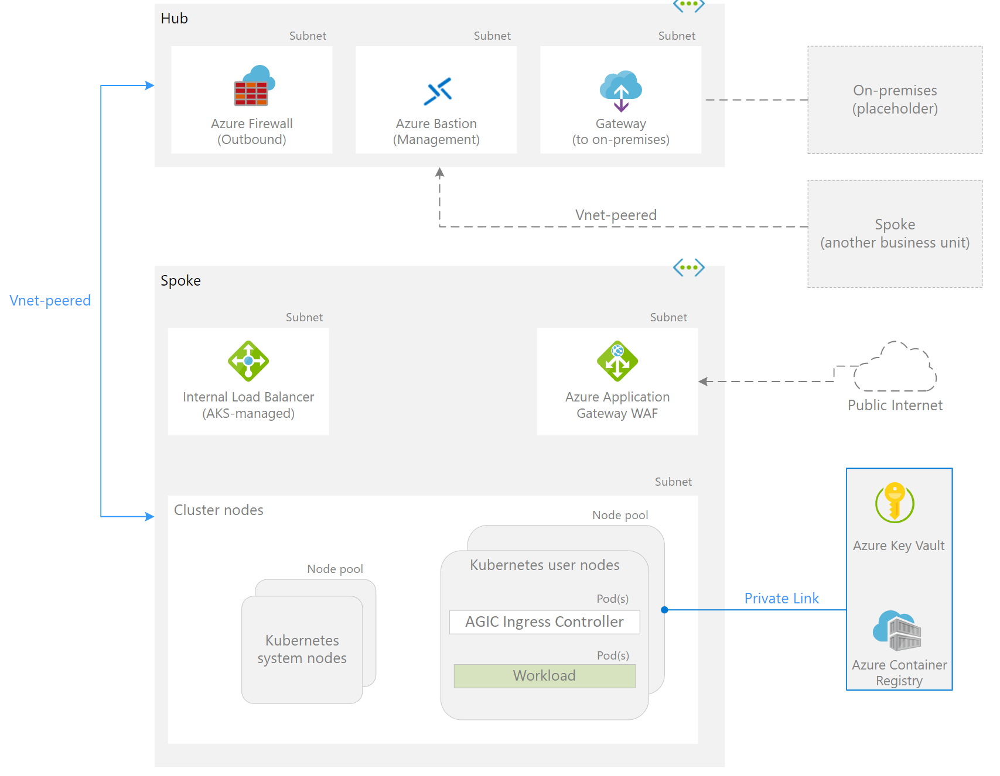
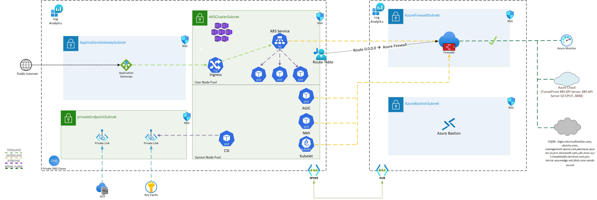

# ESLZ for AKS


## Enterprise enrollment

- Primary Azure AD tenant as RBAC or a diifferent Tenant
- Heightened compliance requirements
- Cost vs Benefits

## Identity and access management

- Managed Identity or Service Principal

- How to Authenticate cluster access - *Client certificate-based* or *Azure Active Directory*

- RBAC

  - Method for isolation - *namespace, network policy, compute (node pool), or cluster*
  - Decide whether application teams can read other workloads in their cluster or in other clusters
  - How many Groups and What Groups - *Cluster Admin, Architects, Developers, Stakeholders* - at the minimum
    - What permissions are needed for each of the above Groups
    - What permissions are needed for the application teams to deploy into the cluster

  - Kubernetes RBAC integrated with Azure AD to limit privileges and minimize granting administrator privileges 

  - Use AKS-managed *Azure AD integration* to use Azure AD for authentication and operator and developer access

  - Use Kubernetes *roles* and *role bindings* to Azure AD groups

  - Ex: Helm chart for *manager* RBAC

    ```yaml
    manager:
      roleName: smoke-manager-roles
      roleNamespace: smoke
      rules:
      - apiGroups: ["*"]
        resources: ["*"]
        verbs: ["*"]
      - apiGroups: ["metrics.k8s.io"]
        resources: ["nodes", "pods"]
        verbs: ["get", "list"]
      bindingName: smoke-manager-rb
      bindingNamespace: smoke
      subjects:
      - name: <azure_ad_group_id>
        kind: Group
    ```

  

  ## Network topology and connectivity

  

  - Azure CNI vs Kubenet

  - Size of the virtual network subnet for AKS - Scaling vs IP address limits

  - External Access

    - Azure Frontdoor with WAF
    - Application Gateway
    - API Management - *Authentication, Policies, Monitoring, Routing* 
      - Outside the Cluster
        - Points to AKS Ingress
        - Private VNET (*Premium*)
        - Custom Domain
        - Authenticate early
      - Inside the Cluster
        - Self Hosted Gateway
        - Less Costly
        - One single Ingress and one APIM can manage routing of services across all namespaces
        - Authenticate late - inside the cluster 

  - InBound access to the cluster

    - Ingress Controller - Off-cluster Or In-Cluster
    - Service Mesh - Observablity, Traffic Splitting, Connected Clusters 
    - Private IP of Ingress (ILB)
    - SSL flow
      - SSL Offload - Application Gateway or AKS Ingress
      - Backend-Protocol: Https
      - SSL PassThru - *Layer 4*
    - Appropriate Certificates
    - Private DNS Zone - multi-tenancy

    

  - Azure Policy Add-On

    - Choose from Set Policies and integrates with as much as of them

  - OutBound from AKS

    - Load Balanced Cluster or UDR cluster (*no pulic Load balancer by default*)
    - restricted egress internet access
    - Azure Firewall or a network virtual appliance cluster by configuring UDRs in the AKS subnet
    - K8s Network Policies can be used to improve security and filter network traffic between pods in an AKS cluster

  - Private Clusters

    

  - AKS Pod to Backend services

    

## Resource organization

- Single Tenant, Multi Tenant
- Management groups
  - Flat structure
  - Segmented structure
  - Hierarchical structure
- container registry topology
  - Per workload
  - Per cluster with multiple workloads in the registry
  - Per all clusters in the landing zone with multiple workloads and clusters in the same registry
  - Per all clusters across multiple landing zones with multiple workloads and clusters in the same registry
- container registry policies
  - Set a policy at the subscription level requiring all hosts in the landing zone to use the defined registry.
  - Set a more granular policy at the resource group level.
  - Set a broader policy at the management group level.

## Governance disciplines

### Build security

- DevSecOps with container images
- Shift Letf - remediate most issues before they start moving down the pipeline

### Registry security

- Drift control from build
- Prevention of push/pull of contaminated images
- Image signing

### Cluster security

- Authentication and authorization
- Network security
- Vulnerability and compliance management
- Isolation
- Taints/Tolerations
- Live Accurate info about the cluster

### Node security

- Runtime protection
- Vulnerability and compliance management
- Azure Policy

### Application security

- Secrets storage - Az KeyVault; integate with a DevOps solution (*Az DevOps*)
- Image Security
- Application Code security

## Operations baseline

- AKS limits. Use multiple AKS instances to scale beyond those limits
- Logically within a cluster and physically in separate clusters.
- Control resource consumption by workloads.
- Virtual machines sizes and the impact of using one or the other. 
  - Larger VMs vs Smaller VMs
  - Multiple Node pools based on workloads
- Monitor and Log AKS
- Updates and Upgrades that you should do
- horizontal pod autoscaler and cluster autoscaler
- Consider securing traffic between pods using - network policies and the Azure policies plug-in
- Control plane logs components

## Deployment Options

- https://docs.microsoft.com/en-us/azure/cloud-adoption-framework/scenarios/aks/eslz-platform-automation-and-devops

## BCDR

- https://docs.microsoft.com/en-us/azure/cloud-adoption-framework/scenarios/aks/eslz-business-continuity-and-disaster-recovery


## Construction Sets for AKS

### AKS Secure Baseline - Public Cluster



https://github.com/monojit18/Enterprise-Scale-for-AKS/tree/main/Scenarios/Secure-Baseline


### AKS Secure Baseline with Private Cluster



https://github.com/monojit18/Enterprise-Scale-for-AKS/tree/main/Scenarios/AKS-Secure-Baseline-PrivateCluster


